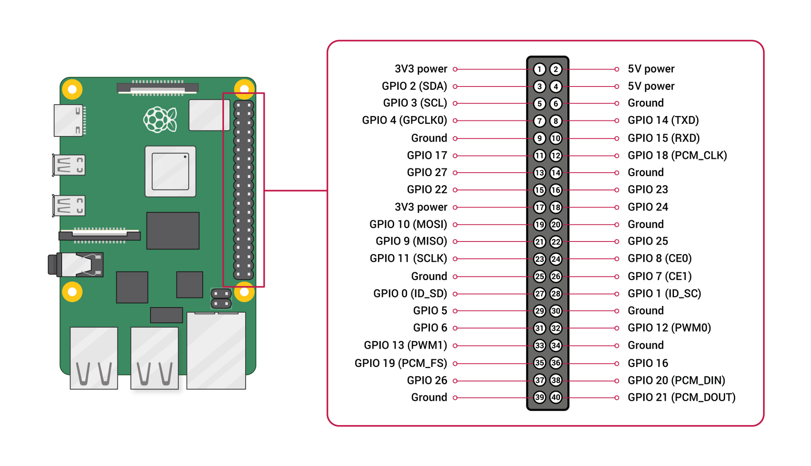
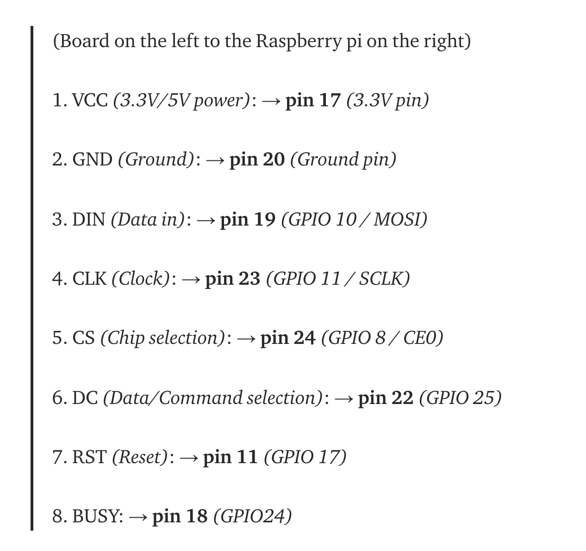

# How to connect e-ink display

## Connect display to Raspberry Pi

Connect PINs according to [this tutorial](https://medium.com/swlh/create-an-e-paper-display-for-your-raspberry-pi-with-python-2b0de7c8820c).





## SSH into Raspberry Pi

`ssh pi@{pi address}`

## Clone the song-spotify-pi repository

`git clone https://github.com/IsaacVerm/song-spotify-pi.git`

This should get you:

- display drivers in `lib/waveshare_epd`
- `requirements.txt` file specifying which packages to install
- `display_on_epd.py` script
- `Font.ttc` used by display script

## Create Python 3 virtual environment on Raspberry Pi

```
python3 -m venv venv
```

And activate it:

```
source venv/bin/activate
```

## Install packages needed

`pip install -r requirements.txt`


## Run display script

`python display_on_epd.py`